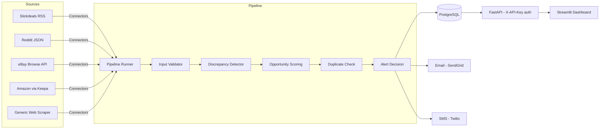

# AACE — Autonomous Arbitrage Commerce Engine

> An automated deal-discovery system that ingests product listings from multiple marketplaces, scores price discrepancies, and surfaces high-confidence arbitrage opportunities through a live dashboard and real-time alerts.

[](LICENSE)
[](https://www.python.org/)
[](https://fastapi.tiangolo.com/)
[](#roadmap)

---

## What it does

Manual deal hunting (Slickdeals, retailer alerts, Reddit threads) doesn't scale. AACE automates the loop:

1. **Ingest** listings continuously from multiple sources (eBay, Amazon, Slickdeals, Reddit, configurable web retailers).
2. **Detect** price discrepancies across sources for the same product.
3. **Score** each opportunity by margin, volume, source reliability, and historical price baselines.
4. **Decide** whether to alert based on configurable score thresholds, dedup rules, and budget guards.
5. **Notify** the operator via email digests and SMS for high-score deals.
6. **Visualize** everything in a Streamlit dashboard for ongoing review and tuning.

## Architecture



The system runs as three Docker services (`postgres`, `api`, `dashboard`) orchestrated via Docker Compose.

## Quick start

Prerequisites: Docker, Docker Compose v2.

```bash
git clone https://github.com/Kpakpavi/aace-execution.git
cd aace-execution
cp .env.example .env
# Edit .env: set AACE_API_KEY to a long random string
docker compose up --build
```

Then:

- API: <http://localhost:8000> (all endpoints require `X-API-Key` header except `/health`)
- Dashboard: <http://localhost:8502>
- Postgres: `localhost:5433` (mapped from container `5432`)

Run a sample pipeline:

```bash
curl -X POST http://localhost:8000/run-pipeline \
  -H "X-API-Key: $AACE_API_KEY" \
  -H "Content-Type: application/json" \
  -d @aace-execution/examples/sample_pipeline_input.json
```

## API endpoints

All require `X-API-Key` except `/health`.

| Method | Path | Purpose |
|---|---|---|
| GET | `/health` | Liveness probe (no auth) |
| POST | `/run-pipeline` | Execute the 6-stage pipeline on supplied inputs |
| GET | `/pipeline-results/{run_id}` | Fetch a single run's results |
| GET | `/opportunities` | List detected opportunities, paginated |
| GET | `/alert-decisions` | List per-opportunity alert decisions |
| GET | `/analytics/opportunity-summary` | Aggregate stats (counts, avg score) |
| GET | `/analytics/top-products` | Top products by opportunity frequency |
| GET | `/analytics/alert-rate` | Rolling alert-fire rate |
| GET | `/analytics/high-score-opportunities` | Opportunities above the hot-deal threshold |
| GET | `/analytics/daily-opportunities` | Per-day opportunity counts (time series) |

## Environment variables

Defined in `.env` (use `.env.example` as a template).

| Var | Required | Purpose |
|---|---|---|
| `POSTGRES_HOST` | yes | DB hostname (`postgres` inside Docker, `localhost` outside) |
| `POSTGRES_PORT` | yes | DB port (`5432` inside Docker, `5433` outside) |
| `POSTGRES_DB` | yes | Database name (default `aace`) |
| `POSTGRES_USER` | yes | DB user (default `postgres` for local dev) |
| `POSTGRES_PASSWORD` | yes | DB password — change for any non-local deployment |
| `AACE_API_KEY` | yes | Shared secret required in `X-API-Key` header |
| `AACE_API_BASE_URL` | dashboard only | API URL the dashboard targets |

Additional vars unlocked as connectors/alerts ship (see [Roadmap](#roadmap)): `KEEPA_API_KEY`, `EBAY_APP_ID`, `EBAY_CERT_ID`, `REDDIT_CLIENT_ID`, `SENDGRID_API_KEY`, `TWILIO_ACCOUNT_SID`, `TWILIO_AUTH_TOKEN`, `TWILIO_FROM_NUMBER`, `ALERT_EMAIL_TO`, `ALERT_SMS_TO`, `SMS_DAILY_BUDGET`, `HOT_SCORE_THRESHOLD`.

## Project structure

```
.
├── Dockerfile              # API container (builds from aace-execution/)
├── docker-compose.yml      # postgres + api + dashboard
├── dashboard/              # Streamlit dashboard
│   ├── app.py
│   └── Dockerfile
├── aace-execution/         # Core service
│   ├── src/aace_execution/
│   │   ├── api/            # FastAPI app + auth middleware + endpoints
│   │   ├── pipeline/       # 6-stage pipeline runner
│   │   ├── workers/        # validator / discrepancy / scoring / alert decision
│   │   ├── persistence/    # PostgreSQL writer + repository
│   │   └── validators/     # Input validation
│   ├── sql/schema.sql      # DB schema (auto-loaded on first compose up)
│   └── tests/              # Pytest suite
└── Autonomous Arbitrage Commerce Engine (AACE)/
    └── directives/         # Architecture decision records + spec
```

## Development

```bash
cd aace-execution
uv sync --dev
uv run pytest
uv run ruff check
```

Tests are workers + persistence + API endpoint coverage. New connectors and alerts must ship with fixtures + tests.

## Roadmap

**Completed (v0.x):**
- 6-stage pipeline (validator → discrepancy → scoring → dedup → alert decision → assembly)
- FastAPI service with X-API-Key auth and analytics endpoints
- PostgreSQL persistence with auto-init schema
- Streamlit dashboard wired to the API via internal Docker network
- Docker Compose orchestration

**In progress (v1.0 target):**
- Slickdeals RSS connector
- Reddit connector (configurable subs)
- eBay Browse + Marketplace Insights connector
- Amazon price history via Keepa
- Generic web scraper (per-retailer YAML config)
- Email alerts (SendGrid) — per-deal + daily digest
- SMS alerts (Twilio) — score-gated, daily-budget-capped
- APScheduler-driven periodic pipeline runs
- Structured JSON logs + Sentry integration + `/metrics`
- GitHub Actions CI (pytest + ruff + docker build)
- VPS deployment + reverse proxy + Tailscale or HTTPS
- Monetization playbook + alert-outcome tracking

See [PLAN.md](aace-execution/PLAN.md) for the day-by-day execution schedule.

## Architecture decisions

The `Autonomous Arbitrage Commerce Engine (AACE)/directives/` folder contains 7 ADRs explaining the major choices (single-service architecture, PostgreSQL for storage, API-key auth, marketplace integration strategy, queue model, observability stack, deployment model) and a full feature spec.

## Security notes

- `.env` is gitignored. Never commit secrets.
- Default `POSTGRES_PASSWORD=postgres` in `docker-compose.yml` is for local dev only — override via `.env` for any deployed instance.
- All API endpoints except `/health` require the `X-API-Key` header.
- For VPS deployments, run the dashboard behind Tailscale or behind a reverse proxy with basic auth — it does not have its own auth layer.

## License

[MIT](LICENSE).

## Contributing

This is a personal project under active development. Issues are welcome; PRs are accepted at the maintainer's discretion.
