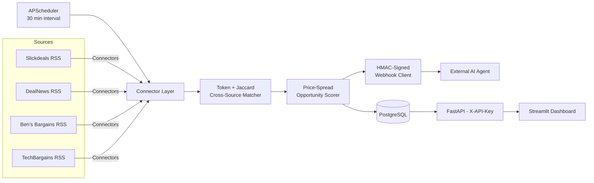

# AACE — Autonomous Arbitrage Commerce Engine

> Continuously pulls deals from multiple aggregator sites, finds the same product across sources, scores the price spread, and ships scored opportunities to an AI agent via a signed webhook.

[](https://github.com/Kpakpavi/aace-execution/actions/workflows/ci.yml)
[](LICENSE)
[](https://www.python.org/)
[](https://fastapi.tiangolo.com/)
[](#development)

---

## What it does

Manual deal hunting doesn't scale. AACE automates the loop end-to-end:

1. **Ingest** — pull live deals from multiple free RSS / JSON aggregator sources every 30 minutes (Slickdeals, DealNews, Ben's Bargains, TechBargains).
2. **Match** — cluster listings across sources by title-token Jaccard similarity so the same product appearing on two sources gets paired.
3. **Score** — compute the price spread (absolute + percent) and threshold it.
4. **Ship** — POST scored opportunities to an external AI agent via HMAC-signed webhook with retry + 24h dedup.
5. **Persist** — write every shipped opportunity to Postgres so the Streamlit dashboard shows what the worker is doing in real time.

## Architecture



The system runs as four Docker services (`postgres`, `api`, `dashboard`, `worker`) orchestrated via Docker Compose.

## Quick start

Prerequisites: Docker, Docker Compose v2.

```bash
git clone https://github.com/Kpakpavi/aace-execution.git
cd aace-execution
cp .env.example .env
# Edit .env: set AACE_API_KEY, AGENT_WEBHOOK_URL, AGENT_WEBHOOK_SECRET
docker compose up -d --build
```

Then:

- **Dashboard**: http://localhost:8502 — live worker opportunities + analytics
- **API**: http://localhost:8000 — all endpoints require `X-API-Key` header except `/health`
- **Postgres**: `localhost:5433` (mapped from container `5432`)
- **Worker**: runs in the background, ticks every `WORKER_INTERVAL_MINUTES` (default 30)

## Local demo (no Docker, no deployment)

Want to see the full loop run end-to-end locally before deploying?

```bash
cd aace-execution
uv sync
# Get a free disposable URL at https://webhook.site
export AGENT_WEBHOOK_URL="https://webhook.site/your-id"
export AGENT_WEBHOOK_SECRET="demo-secret"
uv run python scripts/local_demo.py
```

The demo fetches from all 4 live sources, runs the token matcher, scores cross-source matches, and POSTs to your webhook URL. Even if no matches cross threshold this exact tick, the **diagnostic section** shows the top 5 near-miss pairs so you can see the matcher working on real data.

## API endpoints

All require `X-API-Key` except `/health`.

| Method | Path | Purpose |
|---|---|---|
| GET | `/health` | Liveness probe (no auth) |
| GET | `/worker-opportunities` | List opportunities the scheduled worker shipped to the AI agent |
| POST | `/run-pipeline` | Execute the 6-stage pipeline on supplied inputs (legacy) |
| GET | `/pipeline-results/{run_id}` | Fetch a single pipeline run's results |
| GET | `/opportunities` | Detected opportunities (legacy pipeline) |
| GET | `/alert-decisions` | Per-opportunity alert decisions |
| GET | `/analytics/opportunity-summary` | Aggregate stats |
| GET | `/analytics/top-products` | Top products by opportunity frequency |
| GET | `/analytics/alert-rate` | Rolling alert-fire rate |
| GET | `/analytics/high-score-opportunities` | High-score opportunities |
| GET | `/analytics/daily-opportunities` | Daily time series |

## Environment variables

See `.env.example` for the full annotated list. Required:

| Var | Purpose |
|---|---|
| `AACE_API_KEY` | Shared secret for the `X-API-Key` header |
| `AGENT_WEBHOOK_URL` | Where the worker POSTs scored opportunities |
| `AGENT_WEBHOOK_SECRET` | HMAC-SHA256 secret signing the webhook body |
| `POSTGRES_PASSWORD` | Override the default for any deployed instance |

Optional tuning: `MATCHER_SIMILARITY_THRESHOLD`, `SCORER_MIN_ABS_SPREAD`, `SCORER_MIN_PCT_SPREAD`, `WORKER_INTERVAL_MINUTES`, `SENTRY_DSN`.

## Deployment

A 30-minute walkthrough from a fresh VPS to AACE running 24/7 lives in [`DEPLOY.md`](DEPLOY.md). Covers Hetzner, DigitalOcean, and Oracle Cloud Free Tier.

## Project structure

```
.
├── DEPLOY.md                # 30-min server provisioning walkthrough
├── docker-compose.yml       # postgres + api + dashboard + worker
├── Dockerfile               # builds the api and worker images
├── dashboard/               # Streamlit dashboard
├── aace-execution/
│   ├── src/aace_execution/
│   │   ├── connectors/      # Slickdeals, DealNews, Ben's, TechBargains, Reddit
│   │   ├── pipeline/        # Cross-source matcher + opportunity scorer + 6-stage runner
│   │   ├── integrations/    # HMAC-signed agent webhook client
│   │   ├── persistence/     # Postgres writers
│   │   ├── api/             # FastAPI app + endpoints
│   │   ├── worker.py        # APScheduler entry point
│   │   └── observability.py # Optional Sentry initialization
│   ├── scripts/             # local_demo.py + synthetic demo
│   ├── sql/                 # Auto-loaded schema files
│   └── tests/               # 540+ pytest cases
└── .github/workflows/ci.yml # ruff + pytest on every push and PR
```

## Development

```bash
cd aace-execution
uv sync
uv run pytest -v
uv run ruff check src tests
```

Tests are fully offline (network, sleeping, DB all mocked) and run in ~1 second. The `test_*_connector.py` suites use embedded RSS/JSON fixtures; the matcher, scorer, and webhook suites mock injectable dependencies.

CI runs the full suite + ruff on every push and PR. See the badge at the top of this README.

## Roadmap

**Shipped (v0.1):**
- 4 active connectors (Slickdeals, DealNews, Ben's Bargains, TechBargains) + 1 shelved (Reddit, pending OAuth)
- Token-set + Jaccard cross-source matcher with configurable threshold
- Price-spread opportunity scorer
- HMAC-signed webhook with exponential backoff retry + 24h dedup
- APScheduler worker process running on a configurable interval
- Optional Postgres persistence + dashboard panel
- Optional Sentry error tracking
- GitHub Actions CI (ruff + pytest)
- Docker Compose deployment + hardened VPS walkthrough

**Next (v0.2):**
- Reactivate Reddit via OAuth credentials
- Stronger product-key extraction (brand/model weighting, eventually GTIN/UPC/ASIN)
- eBay Browse + Marketplace Insights connector (sold comps as the gold-standard baseline)
- Amazon price history via Keepa (paid)
- Generic YAML-driven scraper for Walmart, Target, Newegg, Costco
- Structured JSON logs + `/metrics` Prometheus endpoint
- Alert-outcome tracking (which deals did the user actually act on, what was the realized margin)

**Later:**
- International / resale (AliExpress, Temu, StockX, Mercari)
- Multi-currency support
- Per-source rate-limit configuration via UI

## Security notes

- `.env` is gitignored. Never commit secrets.
- Default `POSTGRES_PASSWORD=postgres` in `docker-compose.yml` is for local dev only — override via `.env` for any deployed instance.
- All API endpoints except `/health` require the `X-API-Key` header.
- The webhook to the AI agent is HMAC-SHA256 signed; the agent **must** verify the signature before trusting the payload.
- For VPS deployments, run the dashboard behind Tailscale or a reverse proxy with basic auth — it does not have its own auth layer.

## License

[MIT](LICENSE).

## Contributing

This is a personal project under active development. Issues are welcome; PRs are accepted at the maintainer's discretion.
